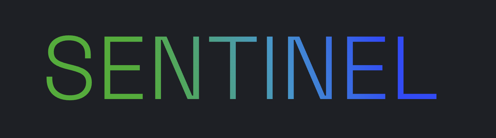
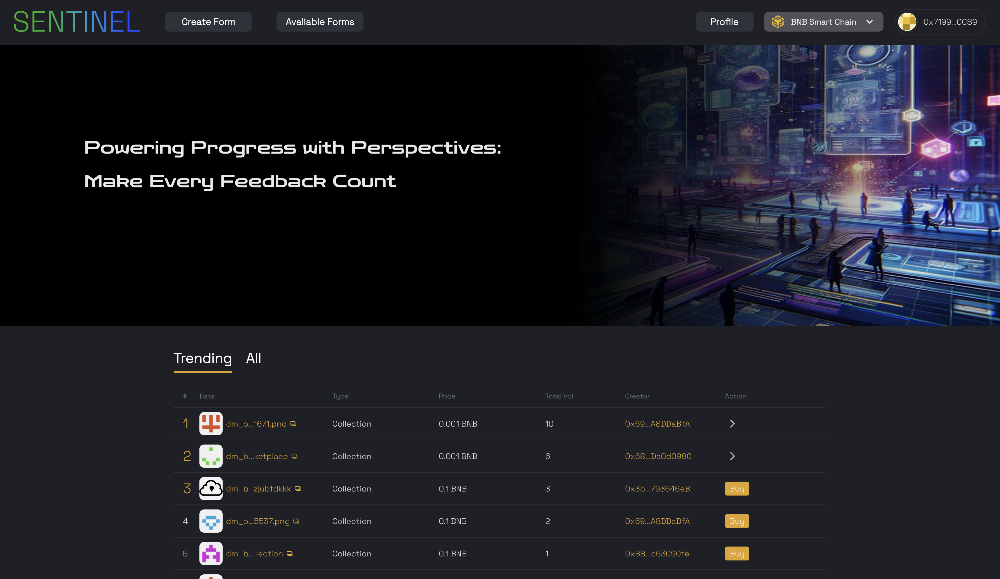
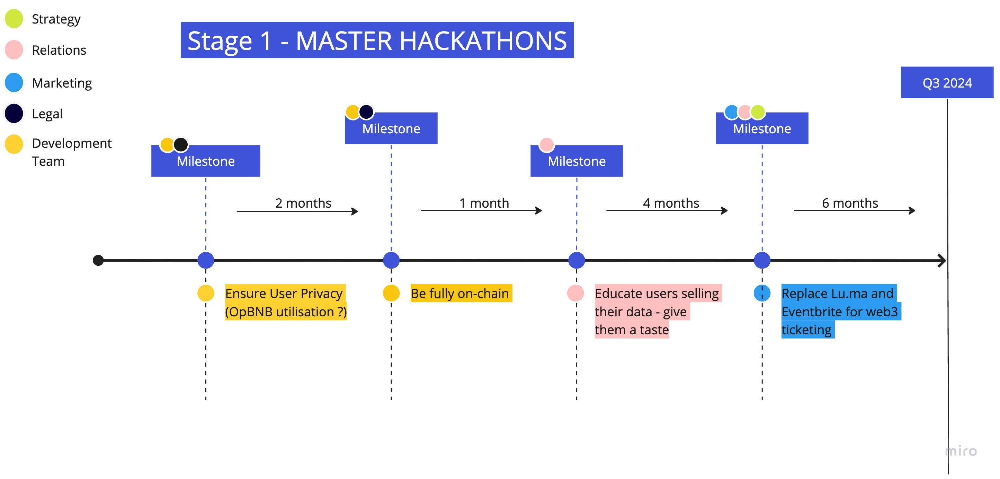

# Sentinel - Greenfield User Feedback Marketplace

   

  

  
  

  

## Table of Contents

- [Features](#features)
- [Description](#discription)
- [Presentation Media](#presentation-media)
- [Getting Started](#getting-started)
- [Contributing](#contributing)
- [Lines of Code](#lines-of-code)
- [Timeline](#timeline)
- [License](#license)

## Features

Sentinel is unique in its approach to create a communication channel between sponsors and community members for the following reasons:

1. **Form Completion Rewards**: Hackathon attendees receive side-event tickets, merch coupons or SDK early access priveleges in return for their feedback.

2. **User Ratings**: Sponsors rate the individuals feedback, over time the users develop a representative value of the utility in the feedback they provide. 

3. **Data Marketplace**: Sponsors must purchase the feedback data from the hackathon attendees which also have the autonomy to price their feedback as they see fit. Adopting a laissez-faire approach allows the exchange to reach market equilibrium for the value of user feedback and how much protocols are willing to pay for it. 

4. **Form Creator Return**: There can be significant costs involved in the form creation, for hackathon attendees to simply answer and sell the responses to other protocols will cripple form generations. Thus we implement a timelock mechanism which prevents the sale of a response until some arbitrary time. Other mechanisms such as royalities are being explored.

## Description

We are a marketplace that regulates the distribution of tickets (within the blockchain community specifically for POC). Tickets are delivered to users as NFTs if they complete questionnaires created by hackathon sponsors, the tickets can be used for whatever the sponsor deems appropriate, merch coupons, side-event passes and beta access keys for example. This provides sufficient incentive mechanisms to motivate users to provide feedback, the data however, still belongs to the user. 

The sponsor can then choose to purchase the data from the user, and with a purchase the user grants sponsors the access to view their feedback. How do we ensure high-quality feedback? Sponsors will be able to vote on the quality of each user response out of 10, users build up a score over time, this improves sponsors trust that the exchange will be valuable. Similar to uber drivers receiving ratings and then being selected first on the search algorithm due to higher ratings relative to other drivers, users with greater ratings due to providing better quality feedback will be more likely to sell their form response to the sponsor. 

Another important component is subsequent and secondary sales of user data, this is not final because the specific strategy is dependent on how the ecosystem will decide Sentinel provides maximum value but we can speculate. Users could have the sale capability of their data time-locked for some time to allow the form creator some return on the form creation investment. Alternatively, there could be no time-lock but with every sale of the data to other sponsors, the form creators could see royalties from the sale. If Greenfield eventually allows for object ownership to be transferable, whereby sponsors could purchase the actual response objects, not just access. The development of a secondary market would be feasible and interesting derivates such as options could even be created. The right to buy responses in bulk at a certain price at some time in the future.

## Presentation Media

https://www.canva.com/design/DAFz3-To7vE/DtJIURBm4c4nVpxl3YvO4A/edit?utm_content=DAFz3-To7vE&utm_campaign=designshare&utm_medium=link2&utm_source=sharebutton

**INCLUDE YOUTUBE LINK HERE**

## Getting Started

To start using Sentinel, you can follow these steps after connecting your BEP20 wallet:

If you are a sponsor: 

1. **Navigate to Create Form**: You will be redirected to google forms to create a questionnaire, then retrieve the link and submit it in the provide link input field.

2. **Encourage hackathon attendees to complete your form**: When hackathon attendees approach for merch, ask about side event entries etc, redirect them to this page and ask them to complete your specific form.

3. **Purchase user feedback**: Based on your own criteria, considering the rating score of each individual and their asking price, purchase access to their feedback

4. **Rate hackathon attendees**: Now you have access, you are encouraged to rate the users response so your business and other protocols can gauge with greater accuracy the quality of feedback they will receive based on a rating.

If you are a hackathon attendee: 

1. **Navigate to Complete Form**: Here you will find every active form you have not yet completed.

2. **Use your newly minted NFT**: Upon completion of the form not only does the platform automatically mint your NFT to your account but the responses belong to you.

3. **Dictate Pricing**: Select for how much you are willing to sell your feedback to the sponsor. If the sponsor is prepared to purchase your feedback you will receive it upon purchase.

## Contributing

We welcome contributions to Sentinel to help improve and expand its functionality. If you are interested in contributing, please follow these steps:

1. Fork this repository.

2. Create a new branch for your feature or bug fix.

3. Make your changes and submit a pull request.

4. Be sure to follow our code of conduct and contribute in a positive and constructive manner.

## Lines of Code

1) Greenfield JS SDK, create bucket: https://github.com/mxber2022/BNB-Hackathon-Istanbul/blob/4d5e8ea595938e1bb96d3759511fae5e47b211b2/greenfield-data-marketplace-frontend/src/pages/Home.tsx#L135
   
2) Greenfield JS SDK, upload object to Greenfield: https://github.com/mxber2022/BNB-Hackathon-Istanbul/blob/4d5e8ea595938e1bb96d3759511fae5e47b211b2/greenfield-data-marketplace-frontend/src/components/object/create/index.tsx#L140

## Timeline

  

## License

This project is licensed under the [MIT License](LICENSE). Feel free to use, modify, and distribute it as you see fit. We hope Sentinel improves your development iterations and hackathon experiences. If you have any questions, concerns, or suggestions, please don't hesitate to reach out to us.

Thank you for using Sentinel!
